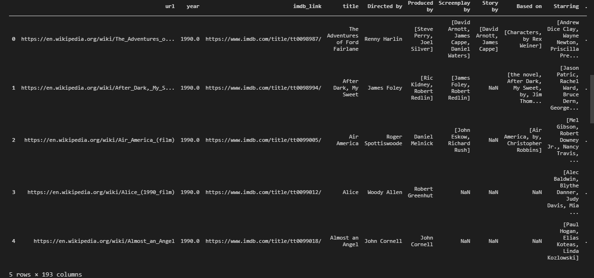
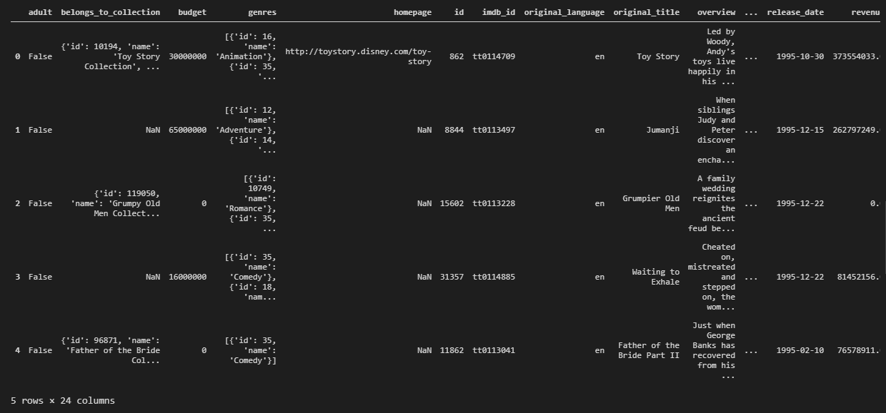
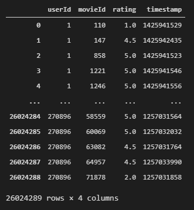
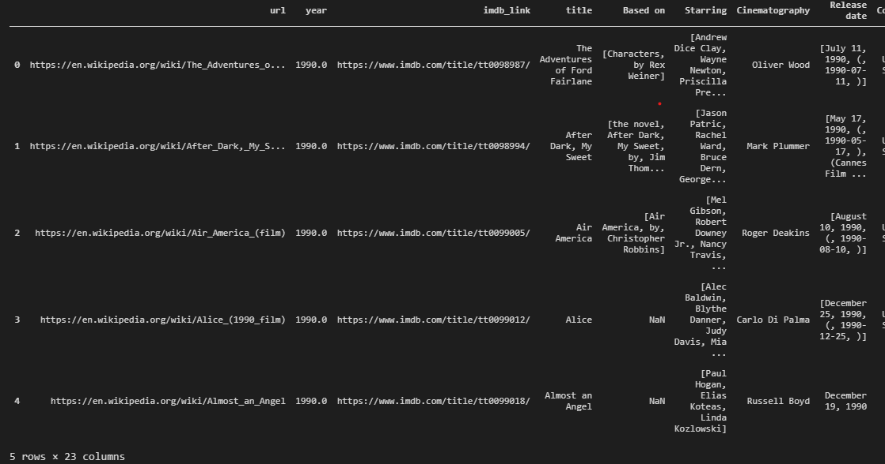
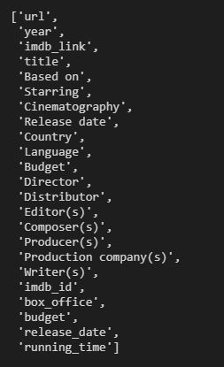
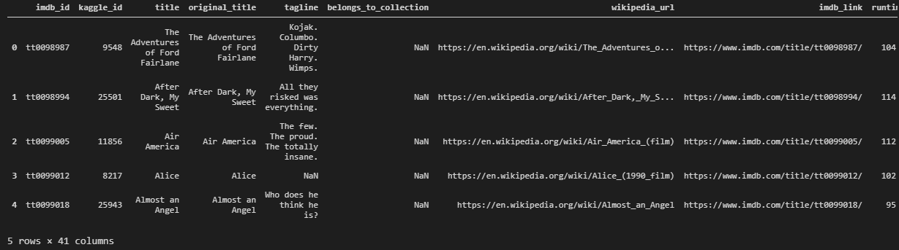
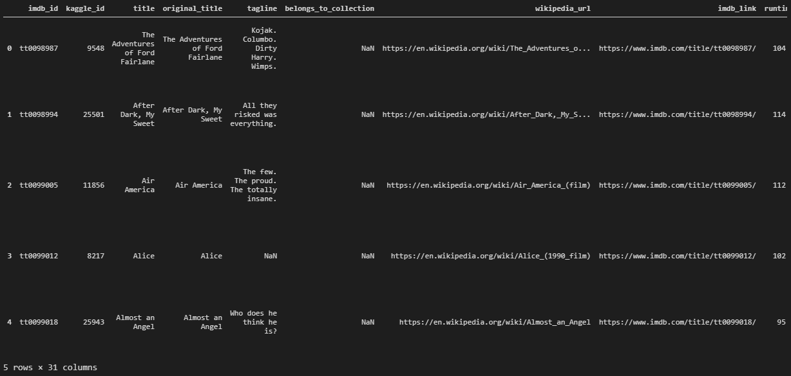
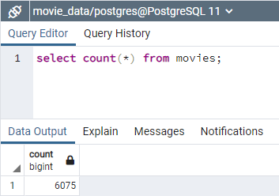
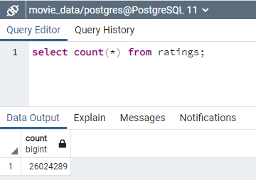

# Movies ETL

## Project Overview

### Background
Amazing Prime Video is a platform for streaming movies and videos on Amazing Prime, the world's largest online retailer. The Amazing Prime Video team would like to develop an algorithm to determine which low budget movies will become popular so that they can buy the streaming rights at a bargain price. Amazing Prime has sponsor a hackathon, providing clean dataset of movie data and asking participants to predict the popular movies.

I am helping Britta, a member of Amazing Prime Video team, in creating data sets for hackathon. 
1. A scrape of wikipedia for all movies released since 1990
2. Movies Rating data from MovieLens

Our task is to:
1. Extract the data from two sources
2. Clean and merge the datasets
3. Load the dataset in a SQL table

### Purpose
Amazing Prime loved the datasets and want to keep them updated. We have to create a automated pipeline which will keep the data updated by taking new data, transforming and cleaning it, and loading the data in existing tables. We are creating a function that will take the data from Wikipedia, Kaggle metadata, and the MovieLens ratings data, and performs ETL.    

## Deliverables

### Deliverable 1: ETL Function to Read Three Data Files
This involves using our knowledge of Python, Pandas, the ETL process, and code refactoring, to write a function that reads in the three data files and creates three separate DataFrames. The three data files are Wikipedia JSON file,  Kaggle metadata CSV file, and MovieLens ratings CSV file.

**The wiki_movies_df DataFrame Screenshot**

**The kaggle_metadata DataFrame Screenshot**

**The ratings DataFrame Screenshot**

### Deliverable 2: Extract and Transform the Wikipedia Data
Using your knowledge of Python, Pandas, the ETL process, and code refactoring, extract and transform the Wikipedia data so you can merge it with the Kaggle metadata.

**The Updated wiki_movies_df DataFrame Screenshot**

**The wiki_movies_df Column List Screenshot**

### Deliverable 3: Extract and Transform the Kaggle Data 
We have to extract and transform the Kaggle metadata and MovieLens rating data, then convert the transformed data into separate DataFrames. Then, we’ll merge the Kaggle metadata DataFrame with the Wikipedia movies DataFrame to create the *movies_df* DataFrame. Finally, we’ll merge the MovieLens rating data DataFrame with the movies_df DataFrame to create the *movies_with_ratings_df*. 

The wiki_movies_df screenshot will remain same as in previous step.

**The movies_with_ratings_df DataFrame Screenshot**

**The movies_df DataFrame Screenshot**

### Deliverable 4: Create the Movie Database
Add the movies_df DataFrame and MovieLens rating CSV data to a SQL database.

**Row count for 'movies' table**

**Row count for 'ratings' table**
